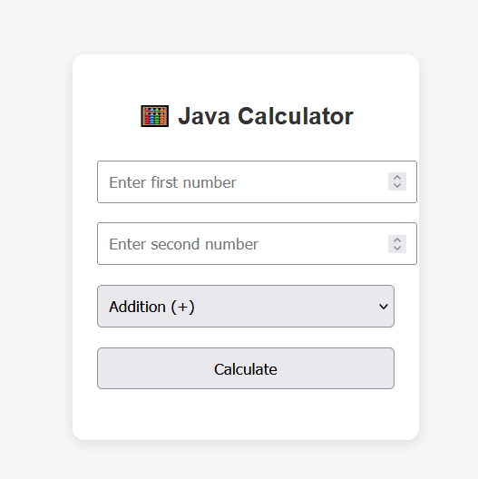
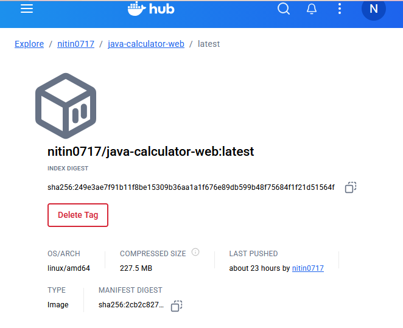

# 📘 Java Calculator Web App (Docker + Kubernetes)

## 🧠 Overview
A simple **Java-based web calculator** containerized using **Docker** and deployed using **Kubernetes (Minikube)**.  
This project demonstrates how DevOps tools streamline application deployment and management.

---

## 🏗️ Tech Stack
- **Java (Spring Boot)** — backend logic  
- **Docker** — containerization  
- **Kubernetes / Minikube** — container orchestration  
- **Git & GitHub** — version control & collaboration

---

## 📂 Project Folder Structure

```bash
📦 java-calculator-web/
│
├── 📁 src/
│   └── 📁 main/java/...        # 💻 Core Java source code (Controllers, Models, Logic)
│
├── 🐋 Dockerfile               # 🧱 Builds Docker image for the app
├── ☸️ deployment.yaml          # ⚙️ Kubernetes Deployment definition
├── 🌐 service.yaml             # 🌍 Kubernetes Service (exposes the app externally)
├── ⚙️ pom.xml                  # 📦 Maven build configuration & dependencies
├── 🧾 README.md                # 📘 Project documentation
```
---

## ⚙️ Run Locally (Without Docker)

```bash
mvn spring-boot:run
```
Visit: [http://localhost:8080](http://localhost:8080)

---

## 🐳 Run with Docker
### 1️⃣ Build Docker Image
```bash
docker build -t java-calculator-web:latest .
```

### 2️⃣ Run Container
```bash
docker run -d -p 8080:8080 java-calculator-web:latest
```

### 3️⃣ Verify
Visit: [http://localhost:8080](http://localhost:8080)

---

## ☸️ Deploy on Kubernetes (Minikube)
### Start Minikube
```bash
minikube start
```

### Deploy App
```bash
kubectl apply -f deployment.yaml
kubectl apply -f service.yaml
```

### Verify Pods and Services
```bash
kubectl get pods
kubectl get svc
```

### Access App
```bash
minikube service calculator-service
```

---

## 📂 Docker + Kubernetes Commands Summary

| Tool | Command | Description |
|------|----------|-------------|
| Docker :- | `docker build -t <name> .` | Build image |
|  | `docker run -d -p <host>:<container> <image>` | Run container |
|  | `docker ps` | List containers |
|  | `docker push <repo>:tag` | Push image to Docker Hub |
| Minikube :- | `minikube start` | Start local cluster |
|  | `minikube dashboard` | View cluster UI |
| K8s :-| `kubectl get pods` | Check pod status |
|  | `kubectl get svc` | Check service |
|  | `kubectl delete all --all` | Cleanup all resources |

---

## 🧠 Why Docker and Kubernetes?
- **Docker:** Packages the app with all dependencies so it runs anywhere.  
- **Kubernetes:** Manages multiple Docker containers, ensuring auto-scaling, self-healing, and easy updates.  
- **Minikube:** Local K8s cluster for testing before cloud deployment.

---
## 🖼️ Application Screenshots

### 🧮 Java Calculator Web App UI

<p align="center">
  
</p>

> This screenshot shows the clean and minimal **Java Calculator Web App UI**, built using Java and containerized with **Docker**, deployed via **Kubernetes (Minikube)** for scalability and portability.

### 🐋 Docker Image

<p align="center">
  
</p>

> This screenshot shows **Docker Image** of the **Java Calculator Web App UI** from the docker hub.

## 🧑‍💻 Author
**NITIN** — DevOps Enthusiast 🚀  
GitHub: [@Nitindas0717](https://github.com/Nitindas0717)
